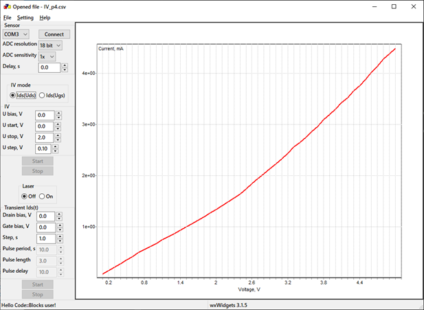
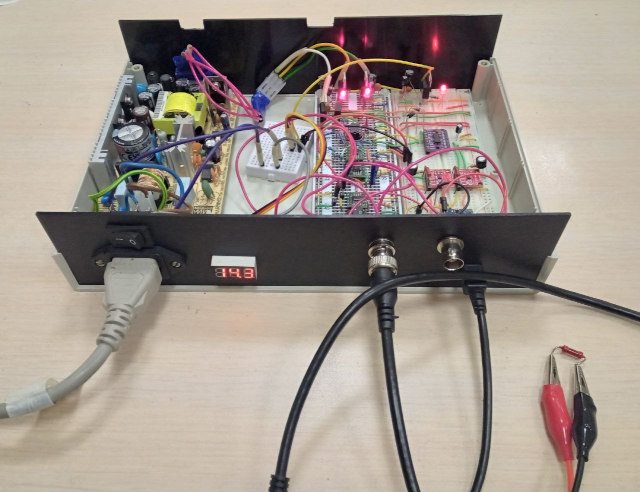

# Current sensing for FET-based sensor (IV-measurement, current logging)

./embedded_arduino

	Code for Arduino microcontroller.
	
./scheme

	Electrical scheme of the device
	
./src

	Source code for a control program. Made using Codeblocks-20.03 / MinGW-W64-builds-4.3.5 (GCC 8.1.0) / wxWidgets-3.1.5 / wxMathPlot. Tested both in GCC 8.1.0 and 13.2.0. Also can be compiled with the makefile.
	Control program current_sensing.exe needs wxmsw315u_gcc_custom.dll. 

This work was supported by the Ministry of Science and Higher Education of the Russian Federation, goszаdanie no.
2019-1080.

International Research and Education Centre for Physics of Nanostructures, ITMO University, Saint Petersburg 197101, Russia

----------------------

Minor bugs:
Control program crashes during connection to a com port in release mode with O2 optimization and works well with O1. 
Can't find the reason yet, but the release program with O2 optimization works from CodeBlock.